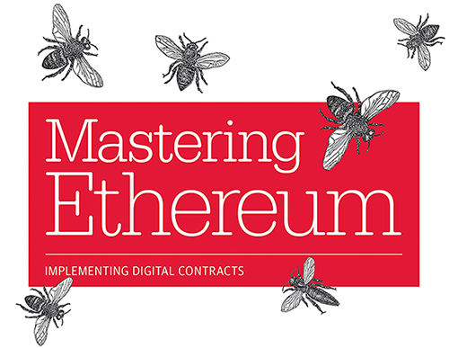
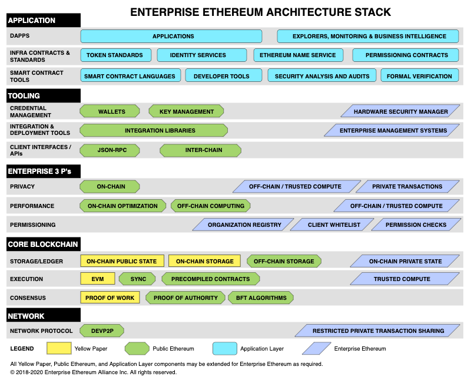

Blockchain has emerged from the once shadowy world of cryptocurrency to become [the most in-demand skill in 2020](https://business.linkedin.com/talent-solutions/blog/trends-and-research/2020/most-in-demand-hard-and-soft-skills), according to LinkedIn. The promise of blockchain is huge. And large companies are continuining to hire and expand their blockchain teams, incl. Facebook, Amazon, Microsft, EY, Deloitte , IBM and Orcale, to name a few. So, it should be well worth the effort to become familiar with how blockchain works, what its perceived benefits are, and as a developer starting building on top of them. 

Over the past few years I've been helping and on-boarding new team members and developers into the blockchain space. This helped me to collect blogs, links, materials and resources and see which worked well for everyone's learning journey. It's time to share that with a broader audience. This guide provides a starting point for developers who're keen to learn more about blockchain and development on top of Ethereum. It will be opinionated and not contain a full list of everything that is available. But rather, a concise list of highly recommended options, from my own experiences. 

1. Blockchain foundations 
1. Ethereum 101 
1. Ethereum Development, Smart contracts & DApps 
1. Advanced Topics, privacy, performance & permissioning 
1. Next steps 

# 1. Blockchain foundations 

New to blockchain? Let's start with a bit of the history and its foundations that motivated the creation and development of blockchain.

- [A Cyberphunk's Manifesto](https://www.activism.net/cypherpunk/manifesto.html), Eric Hughes
- [Why decentralization matters](https://onezero.medium.com/why-decentralization-matters-5e3f79f7638e), Chris Dixon
- [The Promise of the Blockchain](https://vimeo.com/161183966) (VIDEO), Vinay Gupta
- [The shift from open platforms to digital commons](http://www.bollier.org/blog/shift-open-platforms-digital-commons), David Bollier
- [Deconfusing decentralization](https://youtu.be/7S1IqaSLrq8) (VIDEO), Greg Slepak

# 2. Ethereum 101 

Now that we have an understanding where we're coming from, let's dive in a little bit deeper into the fundamental componenents & building blocks.

- [Bitcoin Whitepaper](https://bitcoin.org/bitcoin.pdf), Satoshi Nakamoto - the original whitepaper that started the current trend in blockchain technology: Bitcoin: A Peer-to-Peer Electronic Cash System
- [Ethereum Whitepaper](https://ethereum.org/en/whitepaper/), Vitalik Buterin - a next generation smart contract & decentralized application platform
- [Ethereum Yellowpaper](https://ethereum.github.io/yellowpaper/paper.pdf), Gavin Wood - a more technical version of the Ethereum whitepaper
- [Smart Contracts](https://www.fon.hum.uva.nl/rob/Courses/InformationInSpeech/CDROM/Literature/LOTwinterschool2006/szabo.best.vwh.net/smart.contracts.html), Nick Szabo
- [Ethereum in 25 mins](https://youtu.be/mCzyDLanA7s) (VIDEO), Vitalik Buterin
- [How does Ethereum work, anyway](https://www.preethikasireddy.com/post/how-does-ethereum-work-anyway), Preethi Kasireddy
- [Mastering Ethereum](https://github.com/ethereumbook/ethereumbook) (BOOK), Andreas M. Antonopoulos, Gavin Wood

# 3. Ethereum Development 

Once you've went through all (or at least most) of the above, you should have a solid grasp of all the concepts. So now we can finally move on to the fun part: actually building stuff! 

To get a full, comprehensive overview of the Ethereum development landscape, check out:
- [Ethereum Developers](https://ethereum.org/en/developers/)
- [The full ConsenSys developer tool list](https://github.com/ConsenSys/ethereum-developer-tools-list)

The Ethereum portal covers sections per programming language, to help you filter out what's relevant for you. Though JavaScript is most commonly used, I'd start with something that you're already familiar with, to flatten the learning curve. Use above only for future reference. As mentioned previously, I'm trying to keep it simple and offer a few recommended options, from my own experiences. Feel free to discover, try and learn everything from the developer portals, once you've covered these.

## Courses
- [Blockchain Essentials: An introduction for non-developers](https://academy.b9lab.com/courses/course-v1:Blab+BEC-FREE+2018-08/about), B9lab Academy - a free introductory course that offers a high-level overview of blockchain technology for a non-technical audience. **NOTE** that if you're developer you can probably skip this, as this will all be covered in the developer course. 
- [Introduction to Ethereum for Developers](https://academy.b9lab.com/courses/B9lab/X16-0/2016/about), B9lab Academy - free Ethereum course gives you an overview of blockchain technology and covers the very basics of Ethereum. **NOTE** that the course is slightly outdated in terms of tools and ecosystem, but the basics and principles remain a good starting point. 
- [Crypto startup school](https://a16z.com/crypto-startup-school/), a16z - incredible insight from people like Brian Armstrong from Coinbase, Robert Leshner from Compound, and Sam Williams from Arweave among others.
- [Blockchain and Money](https://ocw.mit.edu/courses/sloan-school-of-management/15-s12-blockchain-and-money-fall-2018/), MIT - This course is for students wishing to explore blockchain technology’s potential use - by entrepreneurs & incumbents - to change the world of money and finance. Watch on [Youtube](https://www.youtube.com/playlist?list=PLUl4u3cNGP63UUkfL0onkxF6MYgVa04Fn)

## Tutorials 
- [Ethereum Studio](https://studio.ethereum.org/) (a web-based IDE, incl. templates)
- [Cryptozombies](https://cryptozombies.io/) (highly recommended)
- [Ethernaut](https://ethernaut.openzeppelin.com/) 
- [Learning Solidity](https://docs.openzeppelin.com/learn/)
- [Truffle Pet shop](https://www.trufflesuite.com/tutorials/pet-shop)
- [Ultimate Introduction to Ethereum Dapp development](https://www.youtube.com/watch?v=rmtsh7Q7sbE&list=PLV1JDFUtrXpFh85G-Ddyy2kLSafaB9biQ), Decypher Media
- [ETH.build](https://eth.build/), [Austin Griffith](https://twitter.com/austingriffith)

## Boilerplates
- [create-eth-app](https://github.com/PaulRBerg/create-eth-app)
- [Scaffold ETH](http://scaffoldeth.io/)
- [OpenZeppelin starter kits](https://openzeppelin.com/starter-kits/)
- [Truffle boxes](https://www.trufflesuite.com/boxes)

Above should cover everything you need to write your own smart contracts and build decentralized application on top of Ethereum. 

# 4. Advanced Ethereum Topics 

The goal of this guide is mainly to help new developers to enter the space and I won't go into much depth on advanced topics, such as design & architecture, scalability, privacy, etc.

But a few pointers, for those who feel up to it. 

## Architecture 

The following diagram is a stack representation of the enterprise Ethereum architecture. While this is aimed towards enterprises, it gives a good overview of the relationship between components and can be part of any implementation. 

For more details check out the [specification](https://entethalliance.github.io/client-spec/spec.html#sec-smart-contract-tools-sublayer) or [Ethereum Enterprise Alliance](https://entethalliance.org/resources/).

As you can see in the diagram, we've covered most from the application layer, to the tooling, core blockchain and networking layer. What's missing really are the Enterprise 3 P's.

- Performance
- Permissioning
- Privacy

Again, this does not only apply to enterprise, but is applicable to any ethereum application. I'll leave these for a future blog post.

## Security & best practices 
- [Ethereum & Smart contract security best practices](https://consensys.github.io/smart-contract-best-practices/), ConsenSys Diligence
- [Best Practices for Smart Contract Development](https://yos.io/2019/11/10/smart-contract-development-best-practices/)

# 5. Next steps 

For those of you who can't get enough and have covered all of above. Here's a few more links that are often posting new updates and video-/blog series.

- [EthereumDev.io](https://ethereumdev.io/)
- [Dapp University](https://www.dappuniversity.com/)
- [Eat the blocks](https://www.youtube.com/c/eattheblocks)
- [Ethereum Developer Bootcamp](https://www.chainshot.com/)

In the end, the best way to learn is by doing. So I'd recommend to go out, try to apply these skills in practice, engage with the community and start contributing...

- Contribute to open-source projects. Check out [BUIDL explorer](https://buidl-explorer.herokuapp.com/) or find bounties to work on at [Gitcoin](https://gitcoin.co/explorer)
- Join hackathons, such as [ETHGlobal](https://www.ethglobal.co/) or [Gitcoin](http://gitcoin.co/hackathon). Make sure to [prepare yourself for a hackathon](https://medium.com/@wslyvh/preparing-for-a-blockchain-hackathon-38f27d2468b5)
- Connect and engage with the [global Ethereum community](https://ethereum.org/en/community/) or find a [local meetup group](https://www.meetup.com/topics/ethereum/)
- A lot of companies are still hiring (remotely).  Jobs are posted on [AngelList](https://angel.co/jobs), [LinkedIn](https://linkedin.com/jobs), [Crypto Jobs List](https://cryptojobslist.com/) and [Blocktribe](https://blocktribe.com/).

---

**Final note:** I'll try to keep this list updated, with the latest tools and developments. If there's anything that you miss, any suggestions or find any broken links, please feel free to reach out! That also includes questions that you might have, or feel stuck with any of the above.