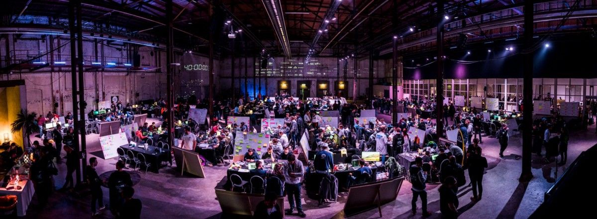
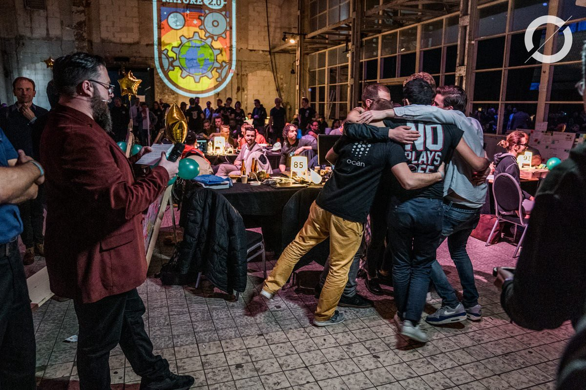

The preparation of [Odyssey](https://www.odyssey.org/) is already in full swing. Odyssey is Europe's largest blockchain hackathon that connects governments, corporates, and non-profits with innovative entrepreneurs from around the world to let them jointly tackle 21st-century challenges. Next to that, there are several [ETHGlobal](https://ethglobal.co/) hackathons scheduled again for this year. I've participated in several of them as a mentor, jury, and hacker and won a grant (from [Brightlands](https://www.brightlands.com/brightlands-smart-services-campus) at Odyssey) and 2 bounties (from [the Graph](https://thegraph.com/) and [dHack](https://www.dhack.io/) at [ETHBerlin](https://ethberlinzwei.com/)).

While both hackathons are quite different, they're the most fun and inspiring events that I've been to over the past years and always looking forward to them. Despite their differences, I think you can prepare for them similarly and hope this guide provides you with essential tools, fundamentals, best practices, and support resources to help you prepare to build a winning solution.

# What is a hackathon
For those unfamiliar with the concept, let's get to the basics first. Hackathon is a combination of "hack" (exploratory programming) and "marathon". In a hackathon small teams of software engineers, UI/UX developers, designers, project managers and/or domain experts are formed. Each group collaborates to complete a project over the course of several hours or a few days. Their work usually has a specific subject and focuses to deliver new ideas or solutions on that subject - for example, developing a new feature, integrating new software or designing a new website.

# Benefits of a hackathon
Hackathons are becoming increasingly important and valuable to companies, corporations, and communities. Hackathons teach new skills, strengthen developer communities, and push the limits of new technologies to create new value. They can be fun, energetic and highly productive since everyone is collaborating on a common goal and purpose.

Successful companies were born from these hackathons, such as GroupMe (acquired by Skype), which began at the TechCrunch Disrupt 2010 hackathon, PhoneGap (Nitobi, acquired by Adobe) as well as other successful innovations - for example, Facebook's "like" button.

# Tips

1. **Set your own goals for the hackathon.** What are you trying to build? Is that feasible in the limited amount of time that you have? Why are you participating? Is it to learn something new, connect with the community or are you planning to win?

1. **Connect with the community.** Walk around during the hackathon, get out of your comfort zone, meet with others, see what they're working on. There is a huge amount of knowledge walking around at these hackathons. Make sure to use that. Don't be afraid to ask questions. Or maybe there is something that you can help them with.

1. **Blockchain never sleeps.** If you're stuck with something and you're haven't found help on the hackathon itself yet, try to reach out to the broader community. Most blockchain development is open-source and globally distributed. There's always someone out there who can help. Check Gitter, Discords, Github or any other communication channels that can help you move forward.

1. **Be prepared…** See below!

1. **Have fun!**

# Preparation
Even if you have never been to a hackathon, everyone brings valuable skills into the mix. The different skills, backgrounds, and people are what make hackathons such unique learning experiences. Make sure you ask a ton of questions and even prepare questions in advance that you want to ask your team, the community, subject matter experts or any others. This will help you make the most out of your time at the hackathon.

# Fundamental reading
- [The Promise of the Blockchain](https://vimeo.com/161183966), Vinay Gupta
- [Why decentralization matters](https://onezero.medium.com/why-decentralization-matters-5e3f79f7638e), Chris Dixon
- [Ethereum in 25 minutes](https://youtu.be/66SaEDzlmP4), Vitalik Buterin
- [How does Ethereum work, anyway](https://medium.com/@preethikasireddy/how-does-ethereum-work-anyway-22d1df506369), Preethi Kasireddy

# Tools
While most hackathons don't allow you to work on your project beforehand, you should have your toolset ready to get hacking as soon as you can. There are many different tools and frameworks out there, which all have their pros, cons. Picking one depends on personal preference and what you're used to. In this guide, I'll describe a common, minimum set of tools that should cover most needs. At least for a hackathon.

## No-/low code
If you don't know how to code, there are excellent no-/low code options available, such as [DAppHero](https://www.dapphero.io/). DappHero allows you to focus on your idea, and build with tools you already know and love.

## Starting with the basics
I assume you're familiar and have a basic developer set-up with Git, npm, docker, homebrew, node.js and of course you're favorite IDE. There are several plugins available for most IDE's, so continue and use what you're comfortable with. My preference is [VS Code](https://code.visualstudio.com/) with the [Solidity plugin](https://marketplace.visualstudio.com/items?itemName=JuanBlanco.solidity). If you want to get started, without installing additional dependencies you can check out online IDE's, such as [Remix](https://remix.ethereum.org/) or [Studio](https://studio.ethereum.org/). Although for building a decentralized application ('DApp') you probably want a regular IDE to integrate or build your smart contracts with your front-end or other application.

## Essentials smart contract tools & frameworks
- [Truffle](https://www.trufflesuite.com/)
- [Ganache](https://www.trufflesuite.com/ganache)
- [Metamask](https://metamask.io/)
- [Infura](https://infura.io/)
- [Ethers.js](https://github.com/ethers-io/ethers.js) or [Web3.js](https://web3js.readthedocs.io/)

## Starter Kits
- [create-eth-app](https://github.com/PaulRBerg/create-eth-app)
- [scaffold-eth](https://github.com/austintgriffith/scaffold-eth)
- [OpenZeppelin starter kits](https://openzeppelin.com/starter-kits/)
- [Truffle boxes](https://www.trufflesuite.com/boxes)

# Networks
Now that you've built your smart contracts you need to deploy that somewhere, other than your local Ganache. Ethereum has several available test networks, incl. a faucet to request test Ether from. This will pay for the gas and deployment costs.

**Ethereum Test networks**
- [Rinkeby](https://rinkeby.etherscan.io/) - [Faucet](https://faucet.rinkeby.io/)
- [Ropsten](https://ropsten.etherscan.io/) - [Faucet](https://faucet.metamask.io/)
- [Goerli](https://goerli.net/) - [Faucet](https://goerli-faucet.slock.it/)

Or if you're aiming to work on Energy-related use-cases
- [Volta](https://volta-explorer.energyweb.org/) - [Faucet](https://voltafaucet.energyweb.org/) (Energy Web Foundation)

You can specify these different networks in your [truffle configuration](https://www.trufflesuite.com/docs/truffle/reference/configuration) and use Infura to directly access the networks through their APIs.

# Practice
If you want to get more familiar with Solidity and writing smart contracts, I can highly recommend trying one of the following:
- [Ethereum Studio](https://studio.ethereum.org/)
- [Cryptozombies](https://cryptozombies.io/)
- [Ethernaut](https://ethernaut.openzeppelin.com/)
- [Truffle Pet shop](https://www.trufflesuite.com/tutorials/pet-shop)
- [Learning Solidity](https://docs.openzeppelin.com/learn/)

# Continue reading
- [Learn more about Ethereum](https://ethereum.org/learn)
- [Ethereum developer portal](https://ethereum.org/en/developers/)
- [ConsenSys developer portal](https://consensys.net/developers/)
- [ConsenSys developer tool list](https://github.com/ConsenSys/ethereum-developer-tools-list)

If there's anything that you miss on the list, or if you have any questions, or you just want to jam on your next hackathon project. Feel free to reach out! Otherwise, I hope to see you hacking somewhere soon!